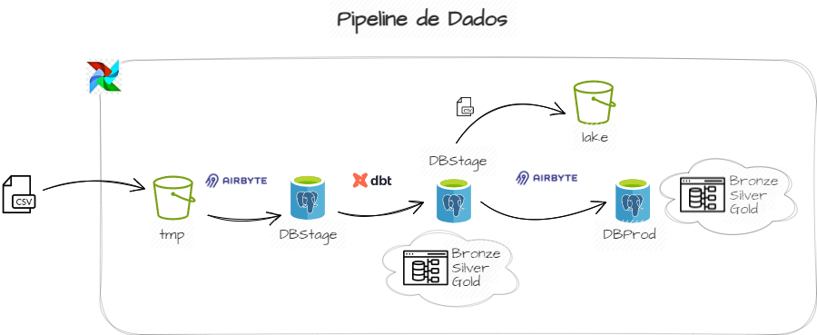

## Links das aplicações

- **Airbyte:**  - `http://localhost:8000/`
- **Airflow:**  - `http://localhost:8080/`
- **Minio:**    - `http://localhost:9000/`

## Caso de Uso

## Requisitos
- Linux Ubuntu (WSL)
- Docker
- Docker Compose
- Python 3.10+
- Recomendado 8GB+ RAM 

## Credenciais

### Airflow
- **username:** `airflow`
- **password:** `airflow`

### Minio
- **access_key:** `minio_admin`
- **secret_key:** `minio_password`
- **url:** `http://localhost:9000`
- **ip interno:** 
    ```
    docker inspect -f '{{range.NetworkSettings.Networks}}{{.IPAddress}}{{end}}' <CONTAINER_ID>
    ```
- **porta:** `9000`

### Postgres Stage
- **username:** `impacta`
- **password:** `impacta`
- **host externo:** `localhost`
- **porta externa:** `5455`
- **host interno:** `postgres_stage`
- **porta interna:** `5432`

### Postgres Prod
- **username:** `impacta`
- **password:** `impacta`
- **host externo:** `localhost`
- **porta: externa** `5454`
- **host interno:** `postgres_prod`
- **porta interna:** `5432`

### Airbyte
 - **url:** `http://localhost:8000`
 - **user:** `airbyte`
 - **password:** `password`
- **ip interno:** 
    ```
    docker inspect -f '{{range.NetworkSettings.Networks}}{{.IPAddress}}{{end}}' <CONTAINER_ID>
    ```

## Resumo
1. Instalar e subir o Airbyte conforme instruções: `https://docs.airbyte.com/deploying-airbyte/docker-compose`
2. Clonar o repositório: `https://github.com/cristianefleal/dataint.git`
3. Acessar o diretório raiz `dataint\`
4. Executar `docker compose up -d`. 
5. Importante: O Airbyte deve ser executado primeiro porque ele cria a rede que será usada pelo Airflow, Postgres e MinIO.
6. Configurar o **MinIO** criando os buckets (tmp, lake)
7. Acessar o **Airflow**:
    - Criar a conexão com o **MinIO**.
    - Executar DAG 1_copy_cvs_to_s3
9. Acessar o **Airbyte**:
    - Configurar o Souce (S3), Destination (Stage) e Connection.
10. Acessar o **Airflow**: 
    - Criar a conexão com o **Airbyte**.
    - Configurar o ID da conexão (connection_id) criada no Airbyte na DAG 2_s3_etl_dbstage
    - Executar DAG 2_s3_etl_dbstage
13. Acessar o **Airbyte**:
    - Configurar o Souce (Stage), Destination (Prod) e Connection.
14. Acessar o **Airflow**:
    - Configurar o ID da conexão (connection_id) criada no Airbyte na DAG 3_dbstage_to_dbprod
    - Após verificações executar DAG 3_dbstage_to_dbprod

## Como usar - passo a passo

### Inicializar o Airbyte

1. Conforme instruções em: `https://docs.airbyte.com/deploying-airbyte/docker-compose`

### Inicializar o Airflow, Postgres e MinIO

1. Abra o terminal ou o prompt de comando.
2. Navegue até o diretório onde deseja clonar o repositório.
3. Execute o seguinte comando:

    ```
    git clone https://github.com/cristianefleal/dataint.git
    ```
4. Volte para o diretório raiz, execute o comando para subir o restantes dos serviços.
    ```
    docker composer up -d
    ```

## Criação dos Buckets

1. Acessar o MinIO através da URL: `http://localhost/9000`
2. Informar as credenciais:
    - **Username:** `minio_admin`
    - **Password:** `minio_password`
3. Criar dois buckets de nomes: tmp e lake.

## Configuração do Airflow

0. Encontrar os IPs internos do serviços s3_minio e postgres_stage no terminal:
    - Executar docker ps, identificar o container_id do serviço e depois:
        ```
        docker inspect -f '{{range.NetworkSettings.Networks}}{{.IPAddress}}{{end}}' <CONTAINER_ID>
        ```
1. Acessar o Airflow através da URL: `http://localhost:8080/home`
2. Informar as credenciais:
    - **Username:** `airflow`
    - **Password:** `airflow`    
3. Criar a conexão com o MinIO:
    - Abrir o Menu: Admin/Connections.
    - Criar uma nova conexão:
        - **Connection Id:** `aws_default`
        - **Connection Type:** `Amazon Web Services`
        - **AWS Access Key ID:** `minio_admin`
        - **AWS Secret Access Key:** `minio_password`
        - **Extra:** `{"aws_acess_key_id":"minio_admin","aws_secret_access_key":"minio_password","endpoint_url":"http://<IP INTERNO>:9000"}`
        - **Save**
4. Executar DAG 1_copy_cvs_to_s3

## Configuração do Airbyte
1. Acessar o Airbyte através da URL:
2. Fornecer as credenciais:
2. Em Sources (*menu esquerdo*), busque e selecione S3. 
3. Configuração:
    - **Source name:** `S3`
    - **Bucket:** `tmp`
    - Abrir seção **The list of streams to sync**
    - **Format:** `CSV Format`
    - **Delimiter:** `;`
    - **Name:** `raw_coffeeshop`
    - Abrir **Optional fields**
    - **Globs:** `coffeeshopsales.csv`
    - **Aws Access Key ID:** `minio_admin`
    - **Aws Secret Access Key:** `minio_password`
    - **Endpoint:** `http://<IP_INTERNO_CONTAINER>:9000`
    - Selecione ***`set up source`***
5. Em Destinations (*menu esquerdo*), busque e selecione Postgres.
6. Configuração Postgres Stage:
    - **Destination name:** `Postgres_Stage`
    - **Host: (IP interno)** `<IP interno>`
    - **Port:** `5452`
    - **DB Name:** `dbstage`
    - **Default Schema**: `airbyte`
    - **User:** `impacta`
    - **Password:** `impacta`
    - Selecione ***`set up destination`***
7. Em Connections (*menu esquerdo*)
    - Selecione o source `S3`
    - Selecione `Use existing destination` e **Postgres_Stage**
    - Altere `Replication frequency` para `Manual`
    - E o modo de sincronização deve ser `Full refresh overwrite` 
    - Selecione`set up connection`
8. Salvar o connection_id da connection 
    - ex: http://localhost:8000/workspaces/12000a99-be37-4b18-8322-5133ef85eb7f/connections/82a3937d-a76d-4ea4-8bb6-45b4491ce4d7/status
    - **connection_id:** `82a3937d-a76d-4ea4-8bb6-45b4491ce4d7`

## Configuração do Airflow
1. Abrir o Airflow
2. Criar a conexão com o Airbyte:
    - Abrir o Menu: Admin/Connections.
    - Criar uma nova conexão:
        - **Connection Id:** `airbyte_default`
        - **Connection Type:** `HTTP`
        - **Host:** `<IP Interno do serviço airbyte-server>`
        - **Login:** `airbyte`
        - **Password:** `password`
        - **Port:** `8001`
        - **Save**
3. Editar a DAG 2_s3_etl_dbstage, passando o valor do **connection_id** do Airbyte para o operator AirbyteTriggerSyncOperator
4. Salvar
3. Executar DAG 2_s3_etl_dbstage

## Configuração do Airbyte
1. Abrir o Airbyte
2. Em Sources (*menu esquerdo*), busque e selecione Postgres. 
3. Configuração:
    - **Source name:** `Postgres`
    - **Host: (IP interno)** `<IP interno>`
    - **Port:** `5453`
    - **DB Name:** `dbstage`
    - **Default Schema**: `bronze silver gold`
    - **User:** `impacta`
    - **Password:** `impacta`
    - Selecione ***`set up destination`***
5. Em Destinations (*menu esquerdo*), busque e selecione Postgres.
6. Configuração Postgres Stage:
    - **Destination name:** `Postgres_Prod`
    - **Host: (IP interno)** `<IP interno>`
    - **Port:** `5453`
    - **DB Name:** `dbprod`
    - **Default Schema**: `public`
    - **User:** `impacta`
    - **Password:** `impacta`
    - Selecione ***`set up destination`***
7. Em Connections (*menu esquerdo*)
    - Selecione o source `Postgres`
    - Selecione `Use existing destination` e **Postgres_Prod**
    - Altere `Replication frequency` para `Manual`
    - E o modo de sincronização deve ser `Full refresh overwrite` 
    - Selecione`set up connection`
8. Salvar o connection_id da connection 
    - ex: http://localhost:8000/workspaces/12000a99-be37-4b18-8322-5133ef85eb7f/connections/82a3937d-a76d-4ea4-8bb6-45b4491ce4d7/status
    - **connection_id:** `82a3937d-a76d-4ea4-8bb6-45b4491ce4d7`

## Configuração do Airflow
1. Abrir 0 Airflow
2. Editar a DAG 3_dbstage_to_dbprod, passando o valor do connection_id do Airbyte para o operator AirbyteTriggerSyncOperator
3. Salvar
4. Executar DAG 3_dbstage_to_dbprod